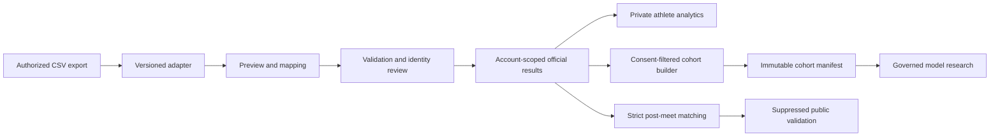

# Data Foundation Architecture

SwimSight Data Foundation v1 acquires permissioned race history without changing the production forecasting algorithm. It separates private product use, model-training eligibility, and public research so an upload never implies research consent.

## Trust boundaries

- Clerk proves the browser identity; PostgreSQL owns application authorization.
- Every account API derives `userId` from Clerk. Client-supplied owner IDs are rejected.
- Coaches receive athlete data only when they are an owner or coach in the same team and the athlete has an active share grant with the required scope.
- Administrators are derived from the server-only `ADMIN_EMAILS` allowlist. A database role alone cannot create an administrator.
- Uploaded text is untrusted. Parsing, mapping, identity resolution, and commit are separate steps.
- Public validation receives only aggregate, thresholded data from active public-research consent and research-grade imported official results with row hash plus external meet/result identifiers.

## Import lifecycle

1. Parse a bounded UTF-8 CSV document.
2. Detect an adapter or accept a user-selected adapter.
3. Validate a one-to-one column mapping.
4. Normalize rows without retaining the raw file.
5. Create a durable preview containing row hashes, provenance, errors, warnings, and identity candidates.
6. Require human review for ambiguous athlete identity or near-duplicate results.
7. Commit only selected valid rows inside a serializable transaction.
8. Rollback removes results created by that batch and invalidates affected evaluation and research artifacts.

## Operational surfaces

- Athlete onboarding collects country, age, category, preferred course, and up to five main events.
- The athlete dashboard supports manual entry, spreadsheet import, sample exploration, PBs, trends, consistency, course-specific analysis, and readiness explanations.
- The coach workspace supports expiring invitations, permission review, roster readiness, PB/trend summaries, prediction availability, meets, and private notes.
- `/internal/readiness` is restricted to trusted administrators and separates raw, consent-eligible, and statistically usable counts.
- `/validation` is public and suppresses unstable evidence.

## Non-goals

- No scraping, access-control bypass, medical judgment, automatic guardian verification, or silent athlete merge.
- No claim that the current user population is representative.
- No learned model promotion from synthetic or low-sample evidence.
